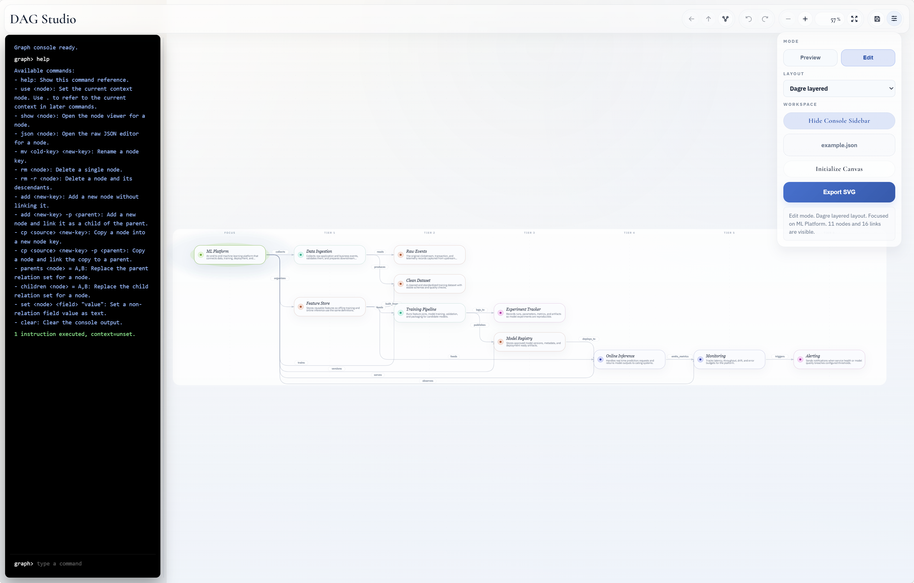

# DAG Studio

DAG Studio is a browser-based graph viewer and lightweight JSON editor for directed graph data.

It is built for fast graph inspection and editing in the browser:

- load a JSON graph and render it immediately
- infer a document-specific field mapping when JSON uses custom field names
- navigate by root, subtree, or parent level
- edit nodes and relationships directly in the UI
- batch graph edits from a text console in `Edit` mode
- undo and redo graph mutations without losing navigation history
- save the updated graph back to JSON or export the current view as SVG



## Quick Start

```powershell
npm install
npm run dev
```

Then open the local dev server URL shown by Vite.

Useful commands:

```powershell
npm run build
npm test
```

When the page loads, the app automatically reads [`public/example.json`](public/example.json).

Each opened document can use its own field mapping. If one file uses `children / define / type` and another uses `next / description / kind`, DAG Studio will interpret each file using its detected schema while preserving the original JSON field names on save.

## What You Can Do

- switch between `Preview` and `Edit` mode
- initialize a blank canvas with one starter node
- focus a node, move back through focus history, or move up to parent levels
- work with multiple roots as a forest
- change layout modes between `BFS`, `Sugiyama layered`, and `Dagre layered`
- inspect every node field in a generic node viewer
- edit relationships, rename nodes, duplicate nodes, or delete a node or subtree
- use the graph console for batch edits with undoable transactions
- save over the original JSON when file access is available, or download a new copy

## Documentation

- [Documentation Index](docs/index.md): overview of the available project docs
- [Usage Guide](docs/usage.md): UI workflows, navigation, editing, saving, and layouts
- [Data Format Guide](docs/data-format.md): supported JSON shapes, field rules, and normalization behavior
- [Graph Console DSL](docs/graph-console-dsl.md): command reference for the edit-mode console
- [Development Guide](docs/development.md): local scripts, source layout, and implementation notes

## Minimal Example

```json
{
  "A": {
    "define": "Root node",
    "children": {
      "B": "related_to",
      "C": "related_to"
    }
  },
  "B": {
    "define": "Child node B"
  },
  "C": {
    "define": "Child node C"
  }
}
```

For the recommended data model and additional examples, see [Data Format Guide](docs/data-format.md).

## Project Structure

- [`src/`](src/): React app source
- [`public/example.json`](public/example.json): sample graph data
- [`docs/`](docs/): user and developer documentation
- [`src/styles/`](src/styles/): split global styles (tokens, layout, controls, graph, console, modals)

## License

MIT License. See [LICENSE](LICENSE) for details.
