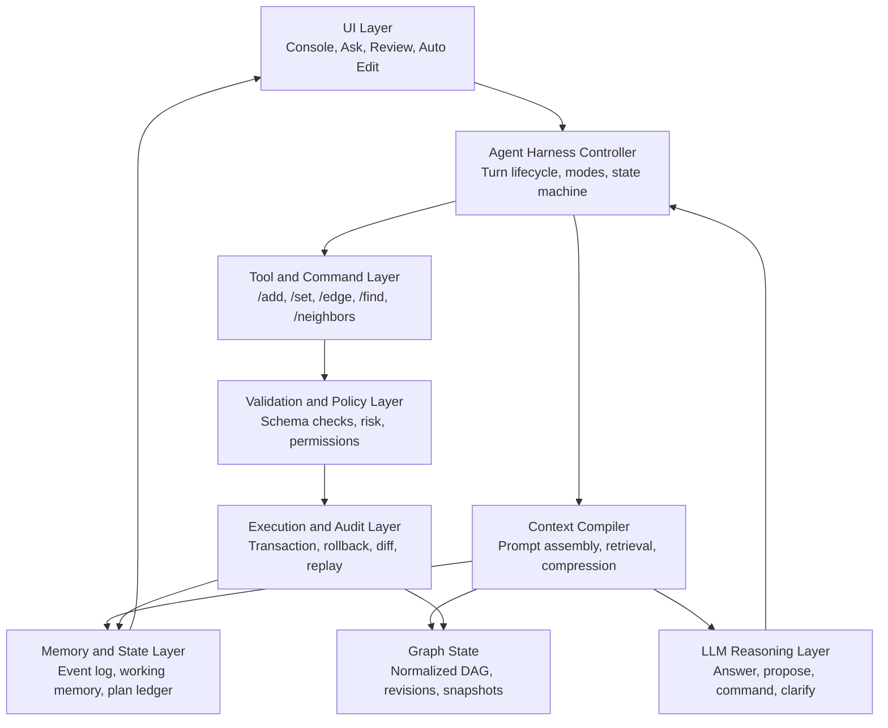
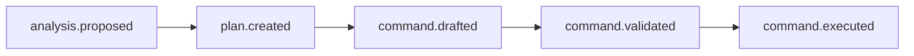
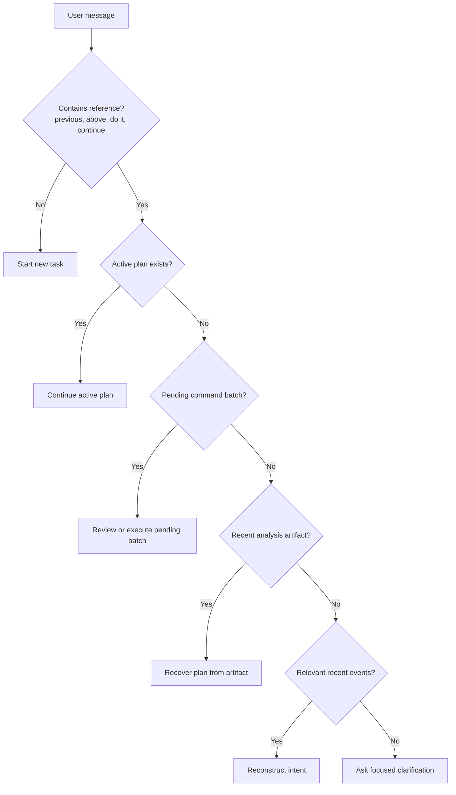
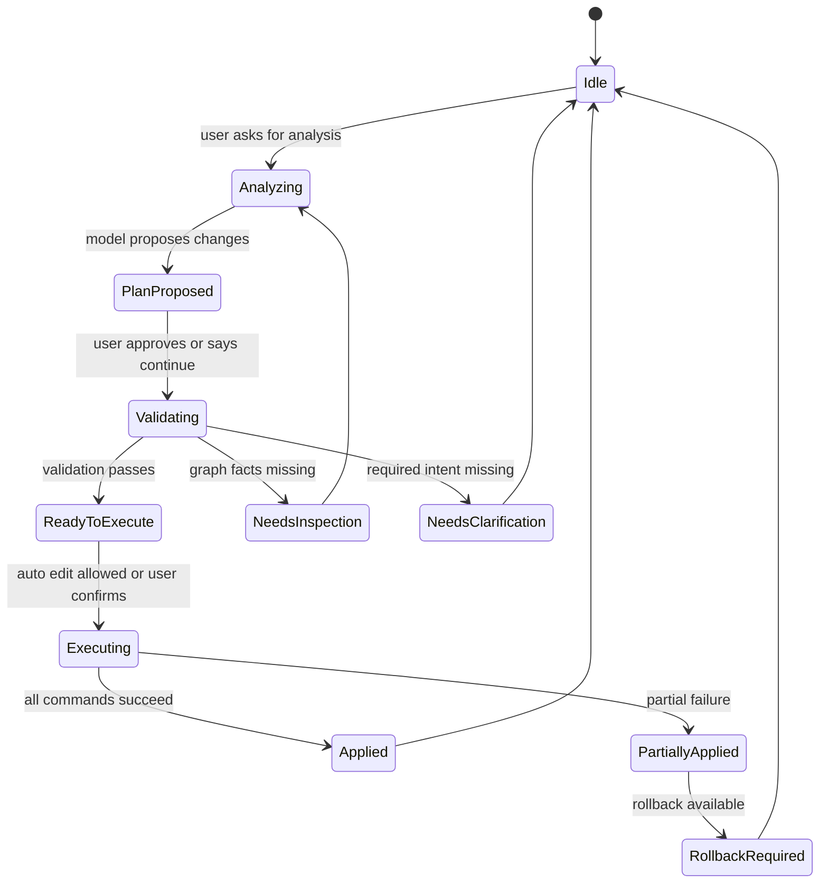
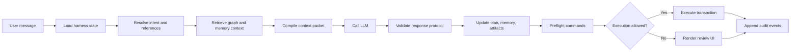

# DAG Studio AI Agent Harness Design Proposal

## Executive Summary

DAG Studio's current AI console integration can answer questions and generate console commands, but it does not maintain structured conversational state across turns. This causes failures when a user refers to prior analysis with phrases such as "based on your previous analysis", "apply what you suggested", or "continue".

The problem should not be solved by simply attaching more chat history to every model request. A reliable graph editing experience requires an AI agent harness: a surrounding system that records events, maintains working memory, stores plans and artifacts, validates commands, executes changes safely, and compiles relevant context for each model turn.

This proposal defines a structured architecture for that harness. The goal is to make AI-assisted graph analysis and editing reliable, inspectable, reversible, and suitable for product, design, and engineering review.

## Goals

- Preserve conversational continuity across AI turns.
- Resolve references such as "previous", "above", "do that", and "complete the changes" without unnecessary clarification.
- Convert AI analysis into structured, reviewable action plans.
- Validate command batches before execution.
- Support safe edit modes: Ask, Review, and Auto Edit.
- Maintain auditability through event logs, artifacts, graph revisions, and execution traces.
- Improve AI context quality for large graphs without relying on raw transcript truncation.

## Non-Goals

- Replacing the existing console command system.
- Giving the model direct write access to graph state.
- Building long-term cloud memory in the first phase.
- Guaranteeing domain correctness for all generated graph content without user review.

## Problem Statement

The current AI request flow is effectively single-turn:

```txt
current graph summary + command reference + latest user message -> model response
```

This works for isolated questions, but breaks down when the user expects continuity. For example:

```txt
User: What are the weaknesses in the group theory chain?
AI: The chain lacks Semigroup, Monoid, Subgroup, Quotient Group...

User: Based on your previous analysis, complete the changes in English.
AI: Please specify which nodes or fields you want to modify.
```

The second response is not just a prompt issue. The system did not preserve the previous analysis as structured state. The model cannot reliably act on information that the harness did not provide.

## Current vs Target Design

| Area | Current Behavior | Target Behavior |
| --- | --- | --- |
| Console history | Displayed as UI text | Stored as append-only event log |
| Previous AI analysis | Plain assistant message | Versioned `AnalysisArtifact` |
| Proposed edits | Mixed into natural language | Structured `ActionPlan` |
| Pending commands | Temporary console output | Versioned `CommandBatch` |
| Graph context | Summary sent each turn | Revisioned graph snapshot plus focused subgraph |
| References such as "previous" | Left for the model to infer | Resolved by reference resolver |
| Command safety | Mostly prompt-based | Preflight validation and policy checks |
| Execution | Direct command run | Transaction with diff and rollback metadata |
| Debugging | Manual console inspection | Trace, replay, diff, and audit log |

## Design Principle

The LLM should reason. The harness should remember, validate, execute, recover, and audit.

The model remains an important reasoning component, but the product should not rely on the model to remember previous turns or enforce execution safety. Those responsibilities belong to the application.

## Proposed Architecture



## Core Components

### 1. Agent Harness Controller

The controller owns the AI turn lifecycle. It should:

- Create a `turnId` for each user message.
- Classify user intent.
- Resolve references to prior plans, artifacts, commands, and graph selections.
- Build a context packet.
- Call the model.
- Validate the model response.
- Store resulting events, artifacts, plans, and command batches.
- Execute commands only when allowed by mode and policy.

### 2. Context Compiler

The context compiler should replace ad hoc prompt assembly. It builds a structured `AiContextPacket` from:

- Current graph state.
- Focused graph subset.
- Available commands and constraints.
- Recent events.
- Active plan.
- Pending command batch.
- Last execution result.
- Relevant artifacts.
- Token budget rules.

The compiler should not blindly truncate history. It should select, summarize, and structure the context needed for the current turn.

### 3. Memory and State Layer

Memory should be split into explicit layers:

| Layer | Purpose | Examples |
| --- | --- | --- |
| Session memory | Current conversation and editing session | Recent AI events, active plan |
| Working memory | Current task state | Focus nodes, current intent, pending command batch |
| Project memory | Graph-specific conventions | Node naming style, definition language, schema rules |
| Episodic memory | Important past decisions | Rejected edits, accepted patterns, preferred style |

Phase 1 only needs session memory and working memory. Project and episodic memory can follow later.

### 4. Plan Ledger

The plan ledger stores structured proposed work. It is the bridge between "what the AI suggested" and "what the system can execute".

Users often say:

- "Do what you just suggested."
- "Apply the previous plan."
- "Complete the modification."
- "Use English."
- "Only do the first two."
- "Undo the last batch."

These should resolve to an `ActionPlan`, not to free-form assistant text.

### 5. Artifact Store

Important AI outputs should be stored as versioned artifacts:

- Analysis artifacts.
- Command batch artifacts.
- Validation reports.
- Graph diffs.
- Graph snapshots.

Artifacts make the system easier to debug, replay, summarize, and recover after long sessions.

### 6. Validation and Policy Layer

Before any graph edit is executed, commands should pass preflight validation:

- Syntax correctness.
- Referenced node existence.
- Duplicate node creation.
- Edge endpoint validity.
- Schema compatibility.
- Field overwrite warnings.
- Orphan creation warnings.
- Destructive operation detection.
- Graph revision conflict detection.
- Confirmation requirement.

### 7. Execution and Audit Layer

Execution should be transactional. Each command batch should record:

- Base graph revision.
- Predicted diff.
- Actual diff.
- Execution result.
- Rollback metadata when possible.
- Audit events.

## AI Request Contract

The current request shape is too small:

```ts
handleAiRequest({
  graphSummary,
  commands,
  userMessage,
});
```

The harness should use a turn-based contract:

```ts
interface AiTurnRequest {
  turnId: string;
  sessionId: string;
  graphId: string;
  graphRevision: string;
  mode: AiMode;
  userMessage: string;
}

type AiMode = "ask" | "review" | "auto_edit";
```

The controller then builds a context packet:

```ts
interface AiContextPacket {
  system: {
    role: "graph_editing_agent";
    language: "zh" | "en" | "auto";
    responseProtocolVersion: "v2";
    editPolicy: EditPolicy;
  };

  graph: {
    summary: string;
    focusedSubgraph?: GraphSubgraph;
    changedSinceLastTurn?: GraphChange[];
    currentSelection?: NodeId[];
    candidateNodes?: NodeCandidate[];
  };

  tools: {
    availableCommands: ConsoleCommandSpec[];
    commandExamples: string[];
    constraints: string[];
  };

  memory: {
    recentEvents: AiEvent[];
    activePlan?: ActionPlan;
    workingMemory: WorkingMemory;
    retrievedArtifacts: ArtifactRef[];
    relevantDecisions: DecisionRecord[];
  };

  execution: {
    pendingCommandBatch?: CommandBatch;
    lastExecutionResult?: ExecutionResult;
    validationHints?: ValidationHint[];
  };

  budget: {
    maxInputTokens: number;
    reservedOutputTokens: number;
    compressionLevel: "none" | "light" | "aggressive";
  };
}
```

## Event Log

Console history should become an append-only event log.

```ts
type AiEvent =
  | UserMessageEvent
  | AssistantAnswerEvent
  | AnalysisProposedEvent
  | PlanCreatedEvent
  | PlanUpdatedEvent
  | CommandDraftedEvent
  | CommandValidatedEvent
  | CommandExecutedEvent
  | GraphChangedEvent
  | ErrorEvent
  | UserApprovedEvent
  | UserRejectedEvent;

interface BaseAiEvent {
  id: string;
  sessionId: string;
  turnId: string;
  timestamp: number;
  graphRevisionBefore?: string;
  graphRevisionAfter?: string;
  causality?: {
    parentEventIds: string[];
    sourcePlanId?: string;
    sourceCommandBatchId?: string;
  };
}
```

Example event types:

```ts
interface AnalysisProposedEvent extends BaseAiEvent {
  type: "analysis.proposed";
  topic: string;
  summary: string;
  findings: string[];
  proposedChanges: ProposedChange[];
}

interface CommandExecutedEvent extends BaseAiEvent {
  type: "command.executed";
  command: string;
  result: "success" | "failed";
  stdout?: string;
  stderr?: string;
  graphDiff?: GraphDiff;
}
```

When the user says "based on the previous analysis", the harness should resolve:



## Working Memory

Working memory stores what the agent is currently doing, not everything that has been said.

```ts
interface WorkingMemory {
  activeTopic?: string;

  currentIntent?: {
    type:
      | "analyze_graph"
      | "modify_graph"
      | "continue_previous_plan"
      | "translate_content"
      | "execute_pending_commands"
      | "inspect_node"
      | "clarify";
    confidence: number;
    sourceUserMessage: string;
  };

  focus: {
    nodeIds: string[];
    edgeIds: string[];
    concepts: string[];
  };

  lastAnalysisRef?: ArtifactRef;
  activePlanId?: string;
  pendingCommandBatchId?: string;

  userPreferences: {
    preferredLanguage?: "English" | "Chinese" | "auto";
    autoApplyLowRiskCommands?: boolean;
    requireReviewForDestructiveChanges?: boolean;
  };

  unresolvedQuestions: string[];
}
```

## Action Plan Schema

```ts
interface ActionPlan {
  id: string;
  sessionId: string;
  graphId: string;

  status:
    | "draft"
    | "proposed"
    | "approved"
    | "validating"
    | "ready"
    | "executing"
    | "applied"
    | "failed"
    | "cancelled"
    | "superseded";

  title: string;
  goal: string;

  source: {
    userTurnId: string;
    analysisEventId?: string;
    createdFromMessage: string;
  };

  scope: {
    targetNodes: NodeId[];
    targetEdges: EdgeId[];
    affectedConcepts: string[];
    graphRevisionBase: string;
  };

  assumptions: string[];
  changes: ProposedChange[];
  commandBatch?: CommandBatch;
  validation?: ValidationReport;

  ui: {
    displaySummary: string;
    requiresUserConfirmation: boolean;
    riskLevel: "low" | "medium" | "high";
  };

  timestamps: {
    createdAt: number;
    updatedAt: number;
  };
}
```

```ts
interface ProposedChange {
  id: string;

  kind:
    | "add_node"
    | "set_property"
    | "add_edge"
    | "remove_edge"
    | "merge_node"
    | "rename_node"
    | "restructure_subgraph";

  target?: {
    nodeId?: string;
    edgeId?: string;
    property?: string;
  };

  rationale: string;
  draftCommands: string[];
  dependencies: string[];
  risk: "low" | "medium" | "high";
}
```

## Response Protocol v2

The current protocol is too coarse:

```ts
type AiPlan =
  | { type: "answer"; text: string }
  | { type: "run_console"; explanation: string; commands: string[] };
```

The next protocol should support analysis, planning, command execution, inspection, and clarification:

```ts
type AiResponse =
  | AnswerResponse
  | ProposeChangesResponse
  | CommandBatchResponse
  | ClarifyResponse
  | InspectResponse;
```

### Propose Changes

```ts
interface ProposeChangesResponse {
  kind: "propose_changes";
  answer: string;

  plan: {
    title: string;
    goal: string;
    assumptions: string[];
    affectedNodes: string[];
    changes: ProposedChange[];
  };

  draftCommands: ConsoleCommandDraft[];

  nextAction: {
    type: "await_user_confirmation" | "validate_then_execute" | "needs_inspection";
    message: string;
  };

  memoryPatch?: Partial<WorkingMemory>;
}
```

### Run Console

```ts
interface CommandBatchResponse {
  kind: "run_console";
  answer: string;

  commandBatch: {
    title: string;
    commands: string[];
    expectedGraphEffects: string[];
    riskLevel: "low" | "medium" | "high";
  };

  preflightRequired: true;
  memoryPatch?: Partial<WorkingMemory>;
}
```

### Clarify

```ts
interface ClarifyResponse {
  kind: "clarify";
  answer: string;

  missingInformation: {
    field: string;
    reason: string;
    candidates?: string[];
  }[];

  fallbackActions?: string[];
}
```

Clarification should be the last resort. If the system can inspect the graph or resolve a prior plan, it should do that first.

## Reference Resolution

Reference resolution should happen before model inference whenever possible.

Priority order:

1. Active plan.
2. Pending command batch.
3. Last analysis artifact.
4. Recent events.
5. Current graph focus or selected nodes.
6. Graph semantic search.
7. Clarification.



## Harness State Machine



Core routing logic:

```ts
if (referencesPreviousWork(userMessage) && state.activePlan) {
  return continuePlan(state.activePlan);
}

if (referencesPreviousWork(userMessage) && !state.activePlan) {
  return recoverFromRecentArtifactsOrClarify();
}

return startNewTask();
```

## Edit Modes

### Ask Mode

The AI can analyze and propose changes, but cannot execute edits.

```txt
User -> AI analysis -> ActionPlan(status = proposed) -> UI review card
```

### Review Mode

The AI generates commands, validation runs, and the UI asks for confirmation.

```txt
ActionPlan -> preflight validation -> predicted diff -> user approve/reject/edit
```

### Auto Edit Mode

Low-risk validated command batches can run automatically. High-risk or destructive commands must fall back to Review mode.

```ts
function shouldAutoExecute(batch: CommandBatch, policy: EditPolicy): boolean {
  if (batch.riskLevel === "high") return false;
  if (batch.commands.some(isDestructiveCommand)) return false;
  if (!batch.validation?.allPassed) return false;
  return policy.autoEditEnabled;
}
```

## Command Preflight

```ts
interface ValidationReport {
  commandBatchId: string;
  graphRevisionBase: string;

  results: {
    command: string;
    valid: boolean;
    errors: string[];
    warnings: string[];
    expectedDiff?: GraphDiff;
  }[];

  allPassed: boolean;
  riskLevel: "low" | "medium" | "high";
  requiresConfirmation: boolean;
}
```

Validation checks:

| Check | Purpose |
| --- | --- |
| Command syntax | Reject malformed commands before execution |
| Node existence | Prevent edits against missing nodes |
| Duplicate creation | Avoid accidental overwrite or ambiguous creation |
| Edge endpoints | Ensure edges reference valid nodes or create them explicitly |
| Field overwrite | Warn before replacing existing definitions or metadata |
| Schema compatibility | Preserve graph data format rules |
| Orphan creation | Flag disconnected or unintended nodes |
| Revision conflicts | Prevent applying commands to stale graph state |
| Destructive operations | Require review for deletion or large rewrites |
| Confirmation policy | Enforce Ask, Review, and Auto Edit rules |

## Graph Transaction

```ts
interface GraphTransaction {
  id: string;
  baseRevision: string;
  commands: string[];
  predictedDiff: GraphDiff;
  actualDiff?: GraphDiff;
  rollbackCommands?: string[];
}
```

Each successful transaction should create a new graph revision and append execution events.

## Focused Graph Context

A single graph summary is not enough for reliable editing. The context compiler should select a focused subgraph.

```ts
interface GraphContextSelectorInput {
  userMessage: string;
  activePlan?: ActionPlan;
  selectedNodes?: NodeId[];
  lastTouchedNodes?: NodeId[];
  graphRevision: string;
}

interface GraphSubgraph {
  centerNodes: GraphNode[];
  neighbors: GraphNode[];
  relevantEdges: GraphEdge[];
  missingButMentionedNodes: string[];
  similarNodeCandidates: NodeCandidate[];
}
```

Selection rules:

- If the active plan has target nodes, include those nodes, one-hop neighbors, and involved edges.
- If the user mentions concept names, use exact match, fuzzy match, then semantic match.
- If the user says "previous" or "just now", use affected nodes from the last analysis or active plan.
- If a command creates edges, include current definitions and neighbors for both endpoints.
- If a command rewrites a definition, include existing title, type, definition, and edges for that node.

## Expected Behavior for the Group Theory Scenario

When the user says:

```txt
Based on your previous modification analysis, complete the changes in English.
```

The harness should:

1. Detect reference terms: "previous", "analysis", "complete changes".
2. Load the active plan or recent analysis artifact.
3. Materialize a command batch from the plan.
4. Validate the command batch.
5. Choose behavior based on mode:
   - Ask: display pending commands.
   - Review: display predicted diff and ask for confirmation.
   - Auto Edit: execute if validation passes and risk is acceptable.
6. Append events to the event log.
7. Update working memory.

The model should not ask which nodes to modify if the active plan already identifies them.

Example command batch:

```txt
/add Semigroup -p Algebra_Structure
/set Semigroup title "Semigroup"
/set Semigroup type "algebraic structure"
/set Semigroup define "A set equipped with an associative binary operation."
/add Monoid -p Semigroup
/set Monoid title "Monoid"
/set Monoid type "algebraic structure"
/set Monoid define "A semigroup with an identity element."
/add Subgroup -p Group
/set Subgroup title "Subgroup"
/set Subgroup type "group-theoretic construction"
/set Subgroup define "A subset of a group that is itself a group under the inherited operation."
/add Quotient_Group -p Group
/set Quotient_Group title "Quotient Group"
/set Quotient_Group type "group-theoretic construction"
/set Quotient_Group define "A group formed by partitioning a group by a normal subgroup."
/set Group define "A group is a set with an associative binary operation, an identity element, and an inverse for every element."
/edge Group Group_Action
/edge Group Representation_Theory
```

## UI Design

The console should render structured cards for plans, validation, and execution results instead of showing only plain text.

### Proposed Plan Card

```txt
+------------------------------------------------+
| Proposed Plan                                  |
| Group theory chain cleanup                     |
+------------------------------------------------+
| Changes: 12                                    |
| Add nodes: 5                                   |
| Add edges: 8                                   |
| Rewrite definitions: 1                         |
| Risk: medium                                   |
+------------------------------------------------+
| [Review Commands] [Apply] [Dismiss]            |
+------------------------------------------------+
```

### Command Review Card

```txt
/add Semigroup -p Algebra_Structure
/add Monoid -p Semigroup
/add Subgroup -p Group
/add Quotient_Group -p Group
/set Group define "A group is a set with ..."
/edge Group Group_Action
/edge Group Representation_Theory
```

### Predicted Diff

```txt
+ Node: Semigroup
+ Node: Monoid
+ Node: Subgroup
+ Node: Quotient_Group
+ Edge: Group -> Group_Action
+ Edge: Group -> Representation_Theory
~ Group.define changed
```

## Storage Model

The initial implementation can use local browser storage or the existing app state. A later implementation can persist this in IndexedDB or a backend.

```txt
ai_sessions
- id
- graph_id
- created_at
- updated_at
- active_plan_id
- working_memory_json

ai_events
- id
- session_id
- turn_id
- type
- payload_json
- graph_revision_before
- graph_revision_after
- created_at

ai_artifacts
- id
- session_id
- graph_id
- type
- title
- version
- payload_json
- created_at

ai_plans
- id
- session_id
- graph_id
- status
- title
- goal
- scope_json
- changes_json
- command_batch_id
- created_at
- updated_at

ai_command_batches
- id
- plan_id
- status
- commands_json
- validation_json
- predicted_diff_json
- actual_diff_json
- created_at
- executed_at

graph_revisions
- id
- graph_id
- parent_revision_id
- diff_json
- created_at
```

## Implementation Plan

### Phase 1: Minimum Reliable Harness

Objective: fix "previous analysis" continuity.

Deliverables:

- `AiEvent` model.
- `WorkingMemory` model.
- `ActionPlan` model.
- `pendingCommandBatch` state.
- Reference resolver.
- Response protocol v2 parser.
- Context packet builder.

Expected result:

- The AI can continue from prior analysis.
- The AI can turn a previous proposal into pending commands.
- The system no longer asks for clarification when an active plan exists.

### Phase 2: Plan and Command Review

Objective: make AI edits reviewable.

Deliverables:

- Plan card UI.
- Command review UI.
- Apply, reject, and edit command actions.
- Command batch schema.
- Plan status transitions.

Expected result:

- Users can inspect proposed graph edits before execution.
- The console becomes a structured workflow surface, not just text output.

### Phase 3: Preflight Validation

Objective: make execution safer.

Deliverables:

- Command syntax validation.
- Node and edge existence checks.
- Duplicate and overwrite warnings.
- Risk classification.
- Predicted graph diff.

Expected result:

- Invalid or risky command batches are caught before execution.
- Auto Edit can be limited to validated low-risk changes.

### Phase 4: Transaction and Audit

Objective: make execution recoverable and debuggable.

Deliverables:

- Graph revision IDs.
- Transaction records.
- Actual diff generation.
- Rollback metadata where possible.
- Replayable event traces.

Expected result:

- Graph edits can be audited.
- Failures can be inspected and recovered.

### Phase 5: Project Memory

Objective: improve long-running quality.

Deliverables:

- Project conventions.
- User preferences.
- Accepted and rejected edit patterns.
- Graph-specific editing style.

Expected result:

- AI output becomes more consistent with project conventions over time.

## Example Turn Handler

```ts
async function handleAiTurn(req: AiTurnRequest): Promise<AiTurnResult> {
  const state = await harnessStore.load(req.sessionId);
  const intent = classifyIntent(req.userMessage, state);

  if (intent.type === "continue_previous_plan") {
    const plan = await resolveActivePlan(state, req.userMessage);

    if (!plan) {
      return recoverOrClarify(req, state);
    }

    const batch = await materializeCommandBatch(plan);

    const validation = await validateCommandBatch({
      graphId: req.graphId,
      baseRevision: plan.scope.graphRevisionBase,
      commands: batch.commands,
    });

    await saveValidation(plan.id, validation);

    if (!validation.allPassed) {
      return buildNeedsInspectionResponse(plan, validation);
    }

    if (req.mode === "auto_edit" && canAutoExecute(batch, validation)) {
      const result = await executeTransaction(batch);
      return summarizeExecution(result);
    }

    return buildReviewResponse(plan, batch, validation);
  }

  const context = await buildContextPacket(req);
  const aiResponse = await callModel(context);
  return processAiResponse(aiResponse, state);
}
```

## Prompt Contract

The system prompt should behave like an operating contract.

```txt
You are a graph editing agent running inside a structured harness.

Use the provided Context Packet as the source of truth.

Resolve references in this priority order:
1. activePlan
2. pendingCommandBatch
3. lastAnalysisArtifact
4. recentEvents
5. focusedSubgraph
6. available inspection commands
7. clarification

If the user says "just now", "above", "as you said",
"based on your analysis", "complete the changes", "continue",
or "do it":
- First check activePlan.
- If activePlan exists, continue or materialize it.
- Do not ask the user to specify nodes unless activePlan and recent artifacts are both absent.

When producing graph edits:
- Prefer structured propose_changes before run_console.
- Never emit commands that reference nonexistent nodes unless the same command batch creates those nodes first.
- Mark destructive changes as high risk.
- If missing graph facts can be inspected using available commands, request inspection instead of asking the user.
```

## Risks and Mitigations

| Risk | Impact | Mitigation |
| --- | --- | --- |
| Context packet becomes too large | Higher latency and cost | Use focused subgraph selection and token budgets |
| Plan state becomes stale after graph edits | Invalid commands | Store base graph revision and validate before execution |
| Model emits invalid protocol | Broken workflow | Strict response parser and fallback clarification |
| Auto Edit applies unwanted changes | User trust issue | Restrict to low-risk validated commands |
| Event log grows indefinitely | Storage pressure | Summarize old events and archive artifacts |
| UI becomes too complex | Lower usability | Phase plan cards gradually and keep console commands visible |

## Success Metrics

- Percentage of "continue previous" requests resolved without clarification.
- Percentage of command batches passing preflight validation.
- Number of prevented invalid command executions.
- User acceptance rate for proposed plans.
- Average time from analysis to applied graph edit.
- Reduction in repeated user instructions.

## Open Questions

- Should harness state persist per browser session, per graph file, or per workspace?
- Should project memory be editable by the user?
- How should plan cards appear in compact console mode?
- What is the minimum graph diff format needed for review?
- Should Auto Edit be disabled by default for all structural edits?
- How should generated nodes be marked as AI-created?

## Recommended Final Shape

Replace the current request pipeline:

```txt
graph summary -> command reference -> user message -> LLM -> answer or commands
```

With a harness pipeline:



The resulting harness state can be represented as:

```ts
interface AiHarnessState {
  sessionId: string;
  graphId: string;
  graphRevision: string;

  workingMemory: WorkingMemory;
  activePlan?: ActionPlan;
  pendingCommandBatch?: CommandBatch;

  recentEventRefs: string[];

  artifactRefs: {
    lastAnalysis?: string;
    lastValidation?: string;
    lastDiff?: string;
  };

  mode: "ask" | "review" | "auto_edit";
}
```

## Conclusion

Adding raw chat history is useful, but insufficient. DAG Studio needs a structured AI agent harness that treats analysis, plans, commands, validation, and execution as first-class objects.

With this design:

- "What happened" is stored in the event log.
- "What the AI is doing" is stored in working memory.
- "What the AI proposed" is stored in the plan ledger.
- "What was generated" is stored in artifacts.
- "What should be sent to the model" is compiled by the context compiler.
- "What can be executed" is decided by validation and policy.
- "What changed" is recorded through transactions, diffs, and audit events.

This shifts DAG Studio from a fragile chat-based feature to a reliable graph editing agent experience.
